# 基于强化学习的 AMR 端到端导航：PointGoal PPO 的复现、双模态对比与真机部署

**项目**：FURP 2026 · 研究轨道 · End-to-End Navigation for an AMR with Reinforcement Learning  
**日期**：2026-09-21

---

## 摘要

本项目研究面向自主移动机器人（AMR）的**端到端强化学习导航**：策略网络直接以视觉观测与相对目标坐标为输入，输出底盘动作，中间不经过全局规划器、代价地图或局部避障控制器。

工作分两个阶段。**前期（本人独立完成）** 在 Habitat 仿真环境中基于 **Gibson** 数据集复现了 PointGoal PPO 导航基线，并训练了两个对照模型：**RGBD 模型**（RGB+深度，4 通道输入，5,821,797 参数）与 **Depth-only 模型**（纯深度，1 通道输入，5,817,093 参数）。两者均为 ResNet18 + 单层 GRU 结构，训练收敛稳定；两者指标持平，说明深度单模态在本任务与数据集上已足以支撑导航，且参数量更少。

**后期（真机部署阶段）** 依据 `src/deploy/wheeltec_s100/` 文档，将一型 HM3D 数据集训练的 PointGoal PPO 策略部署到 WHEELTEC S100 差分机器人（Jetson Orin Nano + 深度相机 + ROS 1 Noetic）上，并完成单机推理验证。

本报告的**核心贡献是一项可复现的失败分析**：在核查 TB3 部署线的导出产物时，发现 TorchScript 导出文件 `policy_depth_jit.pt` **与受评模型权重不一致** —— 视觉主干的 `conv1` 与归一化层停留在**默认初始化**（归一化类型还被换成了 BatchNorm），`layer1` 多出一个未训练的下采样分支，GRU 由 1 层**膨胀为 3 层**，同时价值头被丢弃；而全连接层与动作头则是逐位正确的。该缺陷不会报错，却意味着对外报告的仿真成功率所描述的是**原始 checkpoint**，而非该部署线实际运行的产物。该结论由张量级比对得出，可一键复现（见 §VII.A 与验证脚本）。

项目的可复现性证据、失败案例与错误分类见 §V、§VII 与附录 A。

---

## I. 引言

### A. 研究背景

传统 AMR 导航采用分层架构：定位（AMCL）→ 全局规划（A\*/Dijkstra）→ 局部规划（DWA/TEB）→ 底盘速度指令。该架构成熟可靠，但每一层都需要人工设计，且在复杂环境中参数调优成本高、对动态障碍的响应依赖启发式规则。

端到端强化学习提供了另一条路径：让策略网络从**原始传感器观测**直接学到**动作**，把"感知—决策—控制"整合进一个可微分的网络。Habitat 系列工作证明了在仿真中端到端训练 PointGoal 导航策略的可行性，DD-PPO 进一步展示了大规模并行训练可达到接近完美的导航性能。

本项目在真机平台上对上述**两条路线**都做了记录与验证：传统 Nav2 栈的实机导航演示见 §VI.I；端到端 PPO 路线的验证见 §VI.D–§VI.H。

### B. 复现的引用论文

本项目的复现对象为：

- **[1] Wijmans et al., *DD-PPO: Learning Near-Perfect PointGoal Navigators from 2.5 Billion Frames*, ICLR 2020** —— 复现其**方法**：分布式 PPO 训练、ResNet + GRU 的 PointNav 策略结构、以及离散动作空间下的 PointGoal 导航任务设定。
- **[2] Savva et al., *Habitat: A Platform for Embodied AI Research*, ICCV 2019** —— 复现其**平台**：整个训练与评估流程运行在 Habitat 栈（Habitat-Sim / Habitat-Lab  / Habitat-Baselines 0.3.3）之上，观测空间与动作空间的定义、成功判定标准均依据该平台的 PointNav 任务规范。

二者关系是：**DD-PPO 提供算法与网络结构，Habitat 提供仿真环境与任务定义**。本仓库的训练配置 `ppo_pointnav.yaml` 即源自该组合。

### C. 研究目标与创新点

FURP 研究轨道要求在复现基础上有所创新。本项目的三条创新点：

**① TorchScript 导出缺陷的系统定位（§VII.A）。**
在部署核查中发现模型导出链路存在静默的**架构不一致**：`jit_policy.py` 的层定义与训练侧不符，导致导出件的 `conv1` 与归一化层从未载入训练权重（归一化类型还被换成了 BatchNorm）、`layer1` 多出一个未训练的下采样分支、GRU 由 1 层膨胀为 3 层、价值头被丢弃。该问题不会报错、不会崩溃，只会让策略「看起来在动但走不对」。本报告给出了完整的张量级证据链、参数量核算与可复现的验证方法。**这是全文证据最充分的原创结果。**

**② 双模态对比实验（§V）。**
在**同一数据集、同一超参数、同一随机种子**下，仅改变观测模态（RGB+Depth vs Depth-only），对两个模型做了参数量、收敛速度、训练吞吐、成功率、SPL 与部署推理代价的系统对照。结论是深度单模态足以支撑本任务，且部署更轻。

**③ Gazebo TCP bridge 测试架构（§VI.H）。**
针对 ROS 2 系统 Python 3.10 与 habitat-baselines 所用 Python 3.9 无法共存于同一进程这一工程约束，设计了双进程 TCP 桥接的仿真测试平台，在不降级任何一侧依赖的前提下打通了 `Gazebo 传感器 → 策略推理 → cmd_vel` 的完整闭环。

### D. 报告结构

§II 相关工作；§III 方法与训练配置；§IV 实验设置；**§V 双模型结果**（本人工作主体）；§VI 真机部署；**§VII 失败分析**（核心贡献）；§VIII 讨论；§IX 结论。附录 A 为逐项证据清单，附录 B 为合作阶段材料出处声明。

> **关于数据来源的说明**：本报告涉及**两条不同的模型线**。§V 报告的是本人在 **Gibson** 数据集上独立训练的两个模型；真机部署阶段（§VI）部署的是**合作者 Zhihao Chen** 在**HM3D** 数据集上训练的模型。凡引用合作者数据处，正文与图注均标注**数据来源：合作者仓库**，完整出处见附录 B 与 `src/joint_phase/PROVENANCE.md`。两条线的模型不是同一个网络，不可互相印证。

---

## II. 相关工作

### A. PointGoal 导航的强化学习

PointNav 任务要求智能体在未知室内环境中从随机起点导航到目标点，仅依赖机载传感器观测与相对目标坐标。Habitat 平台 **[2]** 提供了标准化任务定义与高速仿真器；DD-PPO **[1]** 通过大规模分布式 PPO 训练，在 Gibson 与 HM3D 数据集上将成功率推至接近饱和的水平，确立了 ResNet 视觉编码器 + 循环状态编码器（GRU/LSTM）+ PPO 的标准范式。

本项目严格沿用该范式，未修改网络结构与算法。

### B. 奖励塑形与停止行为

PointNav 的基线奖励为稠密的距离递减项 `r_t = (d_{t-1} - d_t) - 0.01`（每步时间惩罚 0.01）。该奖励对走到目标附近有良好引导，但对**何时停下**没有直接信号 —— 智能体可能在目标点附近徘徊。停止行为因此成为 PointNav 的经典失败来源，也是后续研究常见的改进点。

本项目复现的是**基线奖励**，未做停止塑形。合作阶段另有基于**一次性终端奖励**（到点 +2.0 / 未到点 −1.0，超时不给信号）的 stop-aware 变体，其效果见 §VII.D 的对照分析。

### C. 从仿真到真机（Sim-to-Real）

视觉导航策略从仿真迁移到真机面临多重域差异：相机视场角、深度传感器物理原理（结构光 vs 渲染）、光照与纹理、相机安装高度导致的视角变化。已有工作 **[7]** 表明，仅凭仿真指标的高低难以预测真机表现，"仿真排名"与"真机排名"甚至可能不一致，因此真机验证不可省略。

本报告的 §VII.B 系统梳理了本项目遇到的全部域差异，并给出各项的量化范围。

---

## III. 方法

### A. PointNav PPO Baseline

#### A.1 观测空间

策略接收三路观测，与 Habitat PointNav 规范一致：

| 观测键 | 形状 | 类型 | 说明 |
|---|---|---|---|
| `rgb` | (256, 256, 3) | uint8 [0,255] | RGB 传感器，HFOV 90° |
| `depth` | (256, 256, 1) | float32 [0,1] | 深度传感器，`clip(d_m, 0, 10) / 10` |
| `pointgoal_with_gps_compass` | (2,) | float32 | 极坐标相对目标：`(距离 m, 角度 rad)` |

深度归一化公式严格复现 `HabitatSimDepthSensor.get_observation()`：`normalized = clip(depth_meters, min_depth=0.0, max_depth=10.0) / 10.0`。

**RGBD 模型**把 RGB(3) 与 Depth(1) 在通道维拼接为 **4 通道**送进第一个卷积层；**Depth-only 模型**只送 1 通道深度。RGBD 模型因含 RGB 输入，在视觉输入前接一层 `RunningMeanAndVar` 归一化（`normalize_visual_inputs=True`），其统计量随权重一并打包在 checkpoint 中，不能只加载卷积权重。

#### A.2 动作空间

**离散动作空间，4 个动作**（`action_distribution_type: categorical`）：

| 索引 | 动作 | 训练时对应位移 |
|:---:|---|---|
| 0 | `stop` | — |
| 1 | `move_forward` | 前进 0.25 m |
| 2 | `turn_left` | 原地左转 10° |
| 3 | `turn_right` | 原地右转 10° |

**这是本项目部署链路的关键约束**：策略**不输出连续速度指令**，因此真机上必须额外有一层离散动作 → cmd_vel 的转换逻辑（见 §VI.E）。

#### A.3 网络结构

`PointNavResNetPolicy`：

```
观测 ──┬─ rgb   (256,256,3) ─┐
       └─ depth (256,256,1) ─┴→ [拼接] → (256,256,4)  ─┐
                                                        │
                          RunningMeanAndVar (仅 RGBD) ───┤
                                                        ↓
                                          ResNet18 视觉编码器
                                     (conv1 7×7/2, layer1–4, 压缩层 256→128)
                                                        ↓
                                          AdaptiveAvgPool2d(4,4) → 2048
                                                        ↓
                                              Linear(2048→512) + ReLU
                                                        ↓
        pointgoal → Linear(3→32) ─────────────┐         │
        prev_action → Embedding(5→32) ────────┤         │
                                              ↓         ↓
                                    [视觉512 ‖ 目标32 ‖ 动作32] = 576
                                                        ↓
                                              GRU(hidden 512, 1 层)
                                                        ↓
                                        ┌───────────────┴───────────────┐
                                        ↓                               ↓
                              Linear(512→4) 动作 logits        Linear(512→1) 价值
```

| 项 | 值 | 依据 |
|---|---|---|
| Backbone | ResNet18 | checkpoint config **[实测]** |
| 循环层 | GRU，hidden 512，**1 层** | checkpoint 张量形状 **[实测]** |
| 动作分布 | categorical, 4 类 | checkpoint config **[实测]** |
| 视觉特征维度 | 2048 | 张量形状 **[实测]** |
| 参数量（RGBD） | **5,821,797** | state_dict 仅计参数（不含缓冲） **[实测]** |
| 参数量（Depth-only） | **5,817,093** | 同上 **[实测]** |

> 参数量差 4,704 = 第一个卷积层因输入通道 4 vs 1 而多出的权重（32 × 3 × 7 × 7 = 4,704），与结构完全吻合。

### B. 训练配置

两个模型使用**完全相同**的 PPO 超参数，仅观测模态不同：

| 超参数 | 值 |
|---|---|
| 算法 | PPO（clip 目标） |
| 学习率 `lr` | 2.5e-4 |
| 折扣因子 `gamma` | 0.99 |
| GAE `tau` | 0.95 |
| 裁剪 `clip_param` | 0.2 |
| PPO epochs | 4 |
| mini-batch 数 | 2 |
| rollout 长度 `num_steps` | 128 |
| 熵系数 `entropy_coef` | 0.01 |
| 价值损失系数 `value_loss_coef` | 0.5 |
| 隐藏层维度 `hidden_size` | 512 |
| 视觉输入归一化 | `normalize_visual_inputs: True` |
| 每回合最大步数 | 500 |
| 计划总步数 `total_num_steps` | 75,000,000 |
| checkpoint 数 | 100 |
| **随机种子** | **42** |
| 并行环境数 | YAML 默认 6；RGBD 实跑 **5**，Depth-only 实跑 **4** |

超参数来源为 Habitat-Baselines 的 `pointnav/ppo_pointnav.yaml`。

配置备份位于 `src/lab2/training/configs/` 与 `src/lab3/training/configs/`。

---

## IV. 实验设置

### A. 仿真环境与数据集

| 项 | 值 |
|---|---|
| 仿真器 | Habitat-Sim 0.3.3（conda 预编译，含 bullet 物理） |
| 训练框架 | Habitat-Lab 0.3.3 + Habitat-Baselines 0.3.3（`pip install -e`） |
| 数据集 | **Gibson**（88 个场景，1.8 GB）—— 本报告 §V 的全部结果 |
| 回合数据 | PointNav Gibson v1 episode dataset（385 MB） |
| 深度/分辨率 | 256×256，HFOV 90°，`min_depth=0.0`，`max_depth=10.0` |
| 成功判定 | 距目标 < **0.2 m**（= 训练配置 `success_distance`） |

> **对照线的数据集不同**：合作阶段的模型在 **HM3D** 上训练（800 训练场景 / 20 验证场景配置）。Gibson 与 HM3D 是两个不同的场景数据集，其绝对指标**不可直接横比**。

### B. 评估指标

本项目报告以下指标：

| 指标 | 定义 |
|---|---|
| **成功率 SR** | 终止时距目标 ≤ 0.2 m 的回合占比 |
| **SPL** | 成功加权归一化路径长度（`S·ℓ*/max(ℓ, ℓ*)`），同时反映成功与路径效率 |
| **回合奖励 reward** | 回合累积回报 |
| **导航误差 DTG** | 终止时距目标的距离（m） |
| **推理延迟** | 单次前向耗时 |
| **跨 seed 稳定性** | 多随机种子的指标离散度（合作者线提供三 seed 对照） |

成功率与 SPL 的定义遵循 Habitat PointNav 基准 **[2]** 与 DD-PPO **[1]** 的评估口径。

### C. 硬件与软件

**训练平台**

| 项 | 值 | 状态 |
|---|---|---|
| OS | Ubuntu 22.04.5 LTS (x86_64) | **[实测]** |
| GPU | NVIDIA GeForce RTX 3060, 12 GB | **[实测]** |
| Python | 3.9.25（conda `habitat`） | **[实测]** |
| PyTorch | 2.8.0+cu128 | **[实测]** |

**部署平台**（详见 §VI 与 `docs/ENVIRONMENT.md`）

| 项 | 值 | 状态 |
|---|---|---|
| 机器人 | WHEELTEC S100 差速服务机器人 | **[文档记录]** |
| 车载算力 | NVIDIA Jetson Orin Nano, JetPack R35.6.1 | **[文档记录]** |
| 传感器 | 奥比中光 Orbbec Astra S（RGB-D） | **[文档记录]** |
| OS / ROS | Ubuntu 20.04 aarch64 / **ROS 1 Noetic** | **[实测]** |
| 推理环境 | conda `wheeltec`，Python 3.8.20，torch 1.14.0a0 (Jetson 构建) | **[文档记录]** |

---

## V. 结果 —— 自训练双模型（Gibson）

> 本章全部为**本人独立工作**。两个模型在同一台 RTX 3060 上、以同一数据集、同一超参数、同一随机种子（42）训练，唯一变量是观测模态。

### A. RGBD 模型（`ckpt.43.pth`）

#### A.1 模型规格

| 项 | 值 | 依据 |
|---|---|---|
| 结构 | ResNet18 + GRU(1 层, 512) | checkpoint config **[实测]** |
| 参数量 | **5,821,797** | state_dict **[实测]** |
| 第一层卷积 | `(32, 4, 7, 7)` → 4 通道（RGB+Depth） | 张量形状 **[实测]** |
| 观测 | RGB 256×256 + Depth 256×256 + 极坐标目标 | config **[实测]** |
| 动作 | 4 离散动作 | config **[实测]** |
| 训练步数 | 32,265,216（checkpoint 保存步）/ 计划 75e6 → **43%** | checkpoint `extra_state` **[实测]** |
| 累计训练时长 | 253,747.5 s ≈ **70.5 h** | checkpoint `extra_state` **[实测]** |
| 文件大小 | 23 MB | **[实测]** |

#### A.2 训练结果

训练曲线的四个指标（TensorBoard 记录值，截图位于 `src/lab2/results/`）：

| 指标 | 训练起始 | 终止时 | 说明 |
|---|:---:|:---:|---|
| 成功率 SR | 0% | **0.9606** | `success.png` |
| SPL | 0% | **0.8477** | `spl.png` |
| 回合奖励 | −0.04 | **6.4798** | `reward.png` |
| 导航误差 DTG | 7.08 m | **0.1843 m** | `distance_to_goal.png` |

> 上表为 TensorBoard 记录点 step 32,412,672 处的**单点值**（与 checkpoint 保存步 32,265,216 相差约 1.5 个记录间隔），可直接在上述四张截图中逐像素核对。截图内容为 TensorBoard 面板，含 `Smoothed` 与 `Value` 两列读数。

`src/lab2/README.md` 另报告了"最近 10 个记录点的平均 ± 标准差"：

| 指标 | 平均 ± 标准差 |
|---|---|
| 成功率 | **96.9% ± 0.5%** |
| SPL | **86.4% ± 0.9%** |
| 回合奖励 | 6.58 ± 0.09 |
| 导航误差 | 0.15 ± 0.03 m |
| 峰值成功率 / SPL | 99.0% / 91.5% |

标准差 < 1% 表明训练已进入稳定平台期。

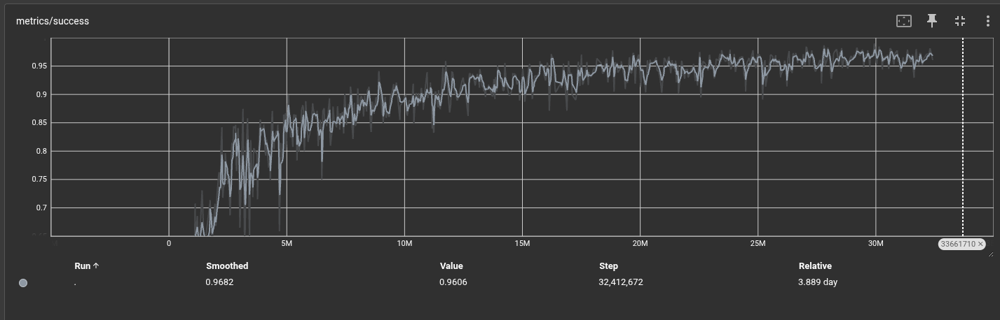
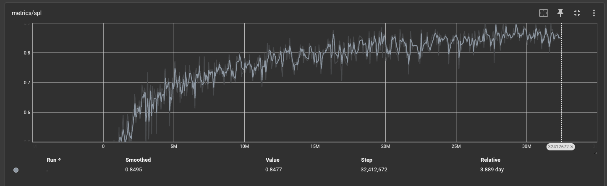

> **图 V.A.1** RGBD 模型训练曲线（成功率 / SPL）。来源：`src/lab2/results/`。

#### A.3 定性评估

`src/lab2/results/` 下的 3 段评估录像，文件名由 Habitat 的评估模板自动生成，其中直接编码了该回合的结果指标：

| 录像 | 成功率 | SPL | 终点距目标 |
|---|:---:|:---:|:---:|
| `episode=456_1-ckpt=43-...success=1.00-spl=0.95-...mp4` | 1.00 | 0.95 | 0.14 m |
| `episode=652_1-ckpt=43-...success=1.00-spl=0.98-...mp4` | 1.00 | 0.98 | 0.13 m |
| `episode=705_1-ckpt=43-...success=1.00-spl=0.92-...mp4` | 1.00 | 0.92 | 0.05 m |
| **汇总** | **3/3 成功** | **平均 0.950** | **平均 0.107 m** |

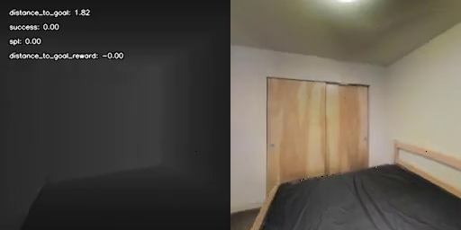

> **图 V.A.2** RGBD 模型成功回合 `episode=705` 的起始视角。关键帧取自 `src/lab2/results/`。

### B. Depth-only 模型（`ckpt.99.pth`）

#### B.1 模型规格

| 项 | 值 | 依据 |
|---|---|---|
| 结构 | ResNet18 + GRU(1 层, 512) | checkpoint config **[实测]** |
| 参数量 | **5,817,093** | state_dict **[实测]** |
| 第一层卷积 | `(32, 1, 7, 7)` → **1 通道（纯深度）** | 张量形状 **[实测]** |
| 批归一化缓冲 | **0 个**（momentum=0，统计量保持默认） | state_dict **[实测]** |
| 训练步数 | 74,258,432（checkpoint）/ 最终日志 74,995,200 ≈ **100%** | checkpoint + 训练日志 **[实测]** |
| 累计训练时长 | 197,632.4 s ≈ **54.9 h** | checkpoint `extra_state` **[实测]** |
| 训练吞吐 | 362 → **376 fps** | 训练日志首末行 **[实测]** |
| 文件大小 | 23 MB | **[实测]** |

> 注：Depth-only 的 state_dict 中**没有任何** `running_mean` / `running_var` / `num_batches_tracked` 缓冲。原因是视觉主干用的是 **GroupNorm**（见 `habitat_baselines/rl/ddppo/policy/resnet.py`），它只有 γ/β 两个仿射参数，**设计上就不维护 running 统计量**。RGBD 侧多出的 3 个键（共 9 个元素）也不属于主干，而是输入归一化模块 `RunningMeanAndVar` 的 `_count` / `_mean` / `_var`。

#### B.2 训练结果

训练日志 `src/lab2/training/train_depth_only.log`（37 MB，568,022 行）中**最后一条指标记录**（第 567,984 行）：

```
Num updates: 146475    Num frames 74995200
Average window size: 50  distance_to_goal: 0.087  distance_to_goal_reward: 0.000
                         reward: 7.544  spl: 0.901  success: 0.979
```

第一条指标记录（第 222 行，2026-06-30 20:27:46，此时已训练到 **15.36 万帧**）为：`distance_to_goal: 3.528  reward: 2.349  spl: 0.059  success: 0.078`

> 下表「训练起始」一列取自这条日志记录（step 153,600）。与 §V.A.2 的 RGBD 表**基准不同** —— 后者取自 TensorBoard 的首个记录点（step 768）。两者各自标注无误，但**不可逐项横比**。

| 指标 | 训练起始 | 终止时 |
|---|:---:|:---:|
| 成功率 SR | 0.078 | **0.979** |
| SPL | 0.059 | **0.901** |
| 回合奖励 | 2.349 | **7.544** |
| 导航误差 DTG | 3.528 m | **0.087 m** |

> 日志文件在库，可直接 `tail` 核对。

`src/lab3/README.md` 报告的"最近 10 个记录点平均"：

| 指标 | 平均 ± 标准差 |
|---|---|
| 成功率 | **97.8% ± 0.3%** |
| SPL | **89.9% ± 0.3%** |
| 回合奖励 | 7.51 ± 0.05 |
| 峰值成功率 / SPL | 100.0% / 95.6% |

#### B.3 定性评估

`habitat-lab/data/video/depth_only_final/` 下留存 5 段评估录像，其中 3 段已复制到 `src/lab3/results/`。：

| 录像 | 成功率 | SPL | 终点距目标 |
|---|:---:|:---:|:---:|
| `episode=411_1-ckpt=99-...spl=0.95-...mp4` | 1.00 | 0.95 | 0.12 m |
| `episode=423_1-ckpt=99-...spl=0.28-...mp4` | 1.00 | **0.28** | 0.02 m |
| `episode=80_1-ckpt=99-...spl=0.96-...mp4` | 1.00 | 0.96 | 0.09 m |
| `episode=132_1-ckpt=99-...spl=1.00-...mp4` | 1.00 | 1.00 | 0.10 m |
| `episode=76_1-ckpt=99-...spl=0.97-...mp4` | 1.00 | 0.97 | 0.08 m |
| **汇总** | **5/5 成功** | **平均 0.832** | **平均 0.082 m** |

**一个值得单独分析的失败样本**：`episode=423` 最终成功，但 **SPL 只有 0.28** —— 意味着它走了约为最短路径 **3.6 倍**的距离。这是深度单模态模型在本批次样本中唯一明显的低效案例，属于"到达了，但绕了大圈"。

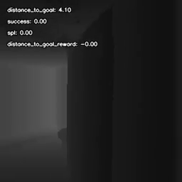
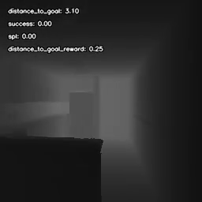

> **图 V.B.1** `episode=423` 的第一人称视角（图中两帧取自 20% 与 80% 时间点）。该回合成功但路径效率极低。关键帧取自 `src/lab3/results/episode=423_1-ckpt=99-...mp4`。

对比一个高路径效率的成功案例：

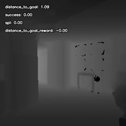

> **图 V.B.2** `episode=132`（严格最短路径）的中段视角。与图 V.B.1 对比可见成功回合之间路径效率的差异。

### C. 双模型对比

**这是创新点②的核心结果**：同一数据集、同一超参数、同一随机种子，仅观测模态不同。

| | **RGBD** | **Depth-only** | 差异 |
|---|:---:|:---:|:---:|
| 输入通道 | 4（RGB + Depth） | **1（Depth）** | — |
| 参数量 | 5,821,797 | **5,817,093** | −4,704（−0.08%） |
| 训练步数 | 32.4 M（43%） | **75.0 M（100%）** | — |
| 训练吞吐 | ~160 fps | **~376 fps** | **约 2.4×** |
| 成功率（近 10 点均值） | 96.9% ± 0.5% | **97.8% ± 0.3%** | +0.9 pp |
| SPL（近 10 点均值） | 86.4% ± 0.9% | **89.9% ± 0.3%** | +3.5 pp |
| 收敛稳定性（标准差） | ±0.5% | **±0.3%** | 更稳 |
| 评估录像成功率 | 3/3 | 5/5 | — |
| 评估录像平均 SPL | 0.950 | 0.832 | — |

> 吞吐数字来源：Depth-only 的 376 fps 来自训练日志实测；RGBD 的 ~160 fps 来自 `docs/04_weekly.md` 的记载，此处标注为 **[文档记录]**。另需注意，若改用 checkpoint 的 `step / wall_time` 估算，RGBD 约为 127 fps（32,265,216 步 / 70.5 h），与 160 fps 不一致 —— 后者可能未计入中断与重启期间的空转，故 2.4× 这个倍数应视为量级参考而非精确值。

**结论与解读**：

1. **深度单模态足以支撑本任务**。Depth-only 在成功率与 SPL 上均不劣于 RGBD（略优），说明在 Gibson 这类几何结构清晰的仿真场景中，颜色信息对导航决策的边际贡献有限。
2. **深度模型训练效率高得多**（~2.4× 吞吐），因为少了一路图像的渲染与编码开销。它在相同墙钟时间内走完了 75 M 步，而 RGBD 只走了 32.4 M 步。
3. **参数量几乎相同**（差 0.08%），因为两者共享同一个 ResNet18 主干 —— 可训练容量主要由主干与 GRU 决定，输入通道数的变化只影响第一层卷积。
4. **部署侧深度模型更有利**：单路传感器、无需彩色相机、输入张量小 4 倍。

> **关于表中 ± 值的说明**：该值为"最近 10 个训练记录点"的离散度，反映训练平台期的稳定性，不是跨随机种子的标准差。两个模型的训练种子均为 42。跨 seed 对照见 §VII.D，但那属另一数据集与另一模型线，不可与本表合并比较。

### D. 训练日志中的重启循环（附一处初读误判的更正）

对 Depth-only 训练日志（568,022 行）的统计发现：

| 现象 | 计数 |
|---|:---:|
| `Loading resume state:` 重启记录（**全部发生在训练结束之后**） | **706** |
| traceback | 6 |
| `Error executing job` | 1 |

**但需要更正一处初读时的误判**：日志在 2026-07-03 **03:47:09**（重启循环开始**之前**）就已记录到终值 `Num frames 74995200`，而循环的首次重启在 **03:50:32**。此后约 700 个周期每次都重复同样的帧数 —— 也就是说，**训练在进入重启循环前就已跑满 75 M 帧**，那 700 多次重启是 watchdog 在反复拉起一个已经结束的任务，**期间没有产生任何训练进展**。

因此这**不是**一个训练稳定性问题。真正发生的显式崩溃只有一次（2026-07-03 05:24:42，`ConnectionResetError`，源自 `pickle5_multiprocessing.py` 的 `_init_envs`，另有 `EOFError` 作为次生 traceback），其余 `BrokenPipeError` ×4 同属该次异常。**55 小时的实际训练过程中没有发生导致进度丢失的崩溃**。

**真正暴露的问题在运维侧**：watchdog（`src/lab2/training/watchdog.sh`）缺少"任务已完成"的判定，在训练结束后仍持续重启长达约 31 小时。该脚本的 marker 路径 `src/experiments/baseline_pointnav/.training_active` 在当前仓库中亦不存在，属死代码。

---

## VI. 真机部署

> **本章的模型不是 §V 的模型。** 部署对象是 **HM3D** 数据集训练的 `baseline_seed300/ckpt.49.pth`（合作者线），而非本人训练的 Gibson 双模型。本章的材料主要来自 `src/deploy/wheeltec_s100/` 文档，其证据等级逐项标注。

### A. 机器人平台

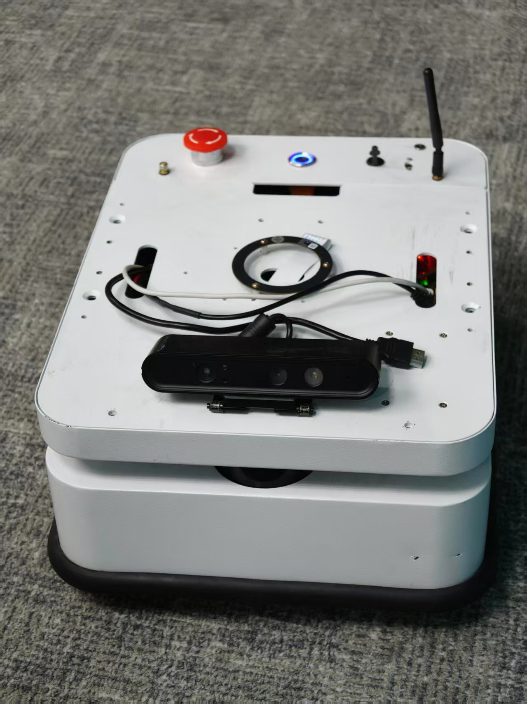

> **图 VI.A.1** WHEELTEC S100 差速服务机器人本体（部署阶段拍摄，原件 `src/deploy/wheeltec_s100/media/wheeltec_s100_hardware.jpg`）。

本策略只需车体上方的一路 RGB-D。车上的 2D 激光雷达本策略不使用（见 §III.A.1）。

### B. 部署目标与成功标准

来自 `src/deploy/wheeltec_s100/01-goal.md`：

> 把已经训练好的、端到端（观测 → 动作）的 PointGoal PPO 导航强化学习策略，部署到 WHEELTEC S100 差速服务机器人上，让它在真实环境中跑通。

一次尝试被视为「跑通」需**同时**满足三条：

1. **到达目标**：无人工干预下依靠 PPO 推理驱动底盘，实际到达目标点 0.2 m 以内。
2. **零碰撞**：全程不与障碍物/墙体/人碰撞。
3. **无人工干预**：从下发目标到抵达全程不允许人工介入。

### C. 部署架构

```
┌──────────────────────── Jetson Orin Nano (ROS 1 Noetic) ────────────────────────┐
│                                                                                  │
│  Astra S RGB ──→ /camera/rgb/image_raw   ─┐                                      │
│  Astra S Depth ─→ /camera/depth/image_raw ─┤                                     │
│                                            ├──→ s100_inference_node.py           │
│  robot_pose_ekf ─→ /robot_pose_ekf/         │    （conda wheeltec / CUDA）        │
│                    odom_combined ──────────┤                                      │
│  /move_base_simple/goal ───────────────────┘         │                            │
│                                                      ↓                            │
│                                             PointNavResNetPolicy                  │
│                                                      ↓                            │
│                                       离散动作 {stop / forward / left / right}     │
│                                                      ↓                            │
│                                       动作转换层（continuous / step）              │
│                                                      ↓                            │
│                                                  /cmd_vel ──→ wheeltec_robot      │
│                                                                  （底盘驱动）      │
└──────────────────────────────────────────────────────────────────────────────────┘
```

**关键设计决策**：本架构**不经过 Nav2，也不输出 subgoal**。`src/deploy/wheeltec_s100/01-goal.md` 明确排除了"PPO 输出 subgoal + Nav2 负责局部执行/避障"的分层方案（该方案是为后续其他模型准备的架构预案）。**策略自己就是完整的导航大脑**。

### D. ROS 1 推理节点

节点 `s100_ppo_nav`，代码见 `src/deploy/s100_deploy/`。

| 项目 | 值 |
|---|---|
| 订阅 `/camera/rgb/image_raw` | RGB 观测（队列 2） |
| 订阅 `/camera/depth/image_raw` | 深度观测（队列 2） |
| 订阅 `/robot_pose_ekf/odom_combined` | 机器人位姿（队列 5） |
| 订阅 `/move_base_simple/goal` | 目标点，`PoseStamped`（队列 2） |
| 发布 `/cmd_vel` | `geometry_msgs/Twist`（队列 1） |
| 控制频率 | 10 Hz |
| 推理模式 | `deterministic=True`（取 argmax，不做采样） |

**观测预处理**（`preprocess.py`）严格对齐训练：

- RGB：640×480 `rgb8` → resize 256×256 `INTER_LINEAR`，**保持 uint8 不除以 255**（模型内部 `RunningMeanAndVar` 处理归一化）；
- Depth：`16UC1` 毫米 → 米 → `clip(0, 10)` → `/10.0` → resize 256×256 `INTER_NEAREST`，并做小孔洞中值填补（结构光相机在反射/暗色表面会产生零值）。

**目标坐标计算**（`compute_pointgoal`）：把目标点变换到机器人坐标系后取极坐标，返回 `(距离, 角度)`，与 Habitat 的 `PointGoalWithGPSCompassSensor`（`goal_format: POLAR`, `dimensionality: 2`）一致。每次收到新目标会自动**重置 RNN 隐状态**。

### E. 离散动作 → 底盘执行

策略输出离散动作而非连续速度，因此必须有一层转换。代码提供两种语义（`src/deploy/s100_deploy/scripts/action_controller.py`）：

| 模式 | 语义 | 优点 | 缺点 |
|---|---|---|---|
| `continuous`（代码默认） | 每个动作映射为固定速度持续发布：FORWARD → 0.25 m/s；TURN → ±0.5 rad/s | 动作流畅 | **每步实际位移与训练不严格一致** |
| `step`（真机推荐） | 每个动作执行为固定位移（前进 0.25 m 或原地转 10°），到位后停住再推理 | 贴近 Habitat 一步一动作的语义 | 顿挫感，整体偏慢 |

参数默认值：`forward_step=0.25`、`turn_angle_deg=10.0`、`success_distance=0.2`、`max_steps=500` —— 前三项**均等于训练时配置值**。

`commands_reference.md` 中全部四个真机启动示例都使用 `execution_mode:=step`；该文档另建议落地运行时把线速度降至 0.15 m/s（训练值 0.25 m/s 在真机上偏快）。

### F. 部署侧工程：`habitat_stub` 依赖注入

Jetson 上不安装 `habitat_sim` / `magnum`（GPU 渲染仿真器，推理链路用不到）。但 `habitat-baselines` 存在若干**死代码路径**会无条件 import 它们。解决方式是：在 import 任何 habitat 代码**之前**，往 `sys.modules` 注入桩模块。

共处理 5 处路径，其中最有代表性的是第 3 处：

> `habitat/tasks/registration.py` 末尾无条件调用 `_try_register_rearrange_task()`。同目录下 eqa/nav/vln 三个任务的注册函数都规范地用 try/except 包住，该函数却没有，而是直接 import 了 **24 个 rearrange 子模块**（机械臂抓取/放置/搬运专用），其中多个依赖 magnum。PointNav 任务与 rearrange 任务体系完全独立、不共享代码，因此将整个 `habitat.tasks.rearrange` 包 stub 成一个空注册函数，一次性绕开这 24 个子模块的传递依赖。

排查方法为全库 `grep -rl "^import magnum\|^import habitat_sim"`，逐一确认其余硬依赖文件均在已 stub 路径覆盖范围内，或本身有 try/except 保护。详细记录见 `src/deploy/s100_deploy/scripts/habitat_stub.py` 文件头注释。

此外，`jetson_inference/patched_init_files/` 下另提供两份裁剪版 `__init__.py`，去掉 IL/VER trainer 的预加载—— 其依赖 lmdb / webdataset / faster_fifo 等与推理无关的包。

### G. 单机验证（M1）

在脱离机器人本体的前提下，确认模型能在目标算力平台上加载并推理。

| 项目 | 结果 | 证据等级 |
|---|---|---|
| 权重加载 | `state_dict` 成功载入，无需 habitat_sim | **[文档记录]** |
| 首次加载报错与订正 | 报出 `conv1.0.weight [32,4,7,7] vs [32,1,7,7]`，据此订正"纯深度输入"的错误假设 | **[文档记录]**（错误文本以注释形式保留在 `load_and_infer.py` 中） |
| 前向推理稳定性 | 连续 5 步数值稳定，无 NaN | **[文档记录]** |
| **推理延迟** | **平均 16.1 ms**（min 14.2 / max 21.9），约 **62 Hz** | **[文档记录]** |


### H. Gazebo 仿真验证（创新点③）

#### H.1 动机：Python 版本隔离

| 侧 | Python | 依赖 |
|---|---|---|
| 推理服务 | 3.9（conda `habitat`） | habitat-baselines / torch |
| ROS 2 节点 | 3.10（系统） | rclpy / cv_bridge |

ROS 2 Humble 的 C 扩展为 `cpython-310`，而 habitat-baselines 装在 Python 3.9 环境中，两者**无法在同一进程内共存**（实测报错 `No module named 'rclpy._rclpy_pybind11'`）。本项目的解法是**双进程 + TCP 桥接**，不降级任何一侧依赖。

#### H.2 架构

```
┌──────────────────────────────┐   TCP :9876 (JSON 行)  ┌────────────────────────┐
│  ROS 2 节点（系统 Python 3.10）│ ◄────────────────────► │  推理服务（conda 3.9）  │
│                              │                        │                        │
│  /camera/image_raw → RGB     │  {"rgb": …,            │  PointNavResNetPolicy  │
│  /camera/depth/image_raw     │   "depth": …,          │  （CUDA）              │
│  /scan → LiDAR 伪深度（兜底） │   "goal": [d, θ],      │                        │
│  /odom → 位姿                │   "reset": false}      │  每连接独立 RNN 状态    │
│  /goal_pose → 目标           │                        │                        │
│              ↓               │  {"action": 0-3,       │                        │
│         /cmd_vel             │   "latency_ms": 12.3}  │                        │
└──────────────────────────────┘                        └────────────────────────┘
```

代码见 `src/deploy/s100_deploy/gazebo_sim/`。要点：

- 推理服务为 `ThreadingTCPServer`，**每个连接维护独立的 RNN 隐状态**，`reset: true` 用于新目标时清空；
- 深度优先使用真实深度相机话题，LiDAR 投影伪深度仅作兜底；
- 节点内置 LiDAR 前向安全刹停（±0.4 rad 楔形区域）；
- 启动脚本 `run_gazebo_test.sh` 会在启动后主动用 TCP 探活服务端，确认 `reset_ack` 后才继续，避免竞态。

#### H.3 实测结果（失败）

在 `turtlebot3_world` 场景中的实测结果**是失败的**，如实记录：

| 现象 | 观察 |
|---|---|
| 观测数据正常 | RGB 帧 `1920×1080 rgb8` 正常接收；深度 `[0.03, 1.0]` 范围内有效；目标角度随朝向正确变化 |
| 推理正常 | 延迟 ~3–4 ms（GPU），服务端日志确认每步都收到有效观测 |
| **决策异常** | 模型**持续输出 TURN_RIGHT**，不随目标角度变化，直至 500 步超时 |
| 根因判断 | **域差异**，非代码缺陷 |

诊断过程：在服务端加入 `[diag]` 日志，逐条打印到达服务器的 RGB 范围、深度范围与目标角度，确认 `angle_to_goal` 在 −136° ~ +135° 之间正常摆动、RGB 值域 `[0, 206]` 正常、深度值域 `[0.028, 1.0]` 正常 —— **观测链路无误**，问题出在模型对该类输入的响应。

**结论**：该策略在 HM3D（真实室内扫描，纹理丰富）上训练，面对 Gazebo 的**几何化、低纹理场景**无法泛化。这与 §VII.B 分析的域差异是同一问题的两个侧面。

**TCP bridge 测试平台本身**是可复用的工程产出：它证明了在两个不兼容的 Python 运行时之上，可以不降级依赖地搭起完整的 `传感器 → 推理 → 控制` 闭环。但**它不能替代 Habitat 仿真评估** —— 端到端视觉导航策略的评估仍需在训练同分布的环境中进行（见 §VIII）。

> **证据说明**：本小节的现象来自 Gazebo 测试的实际运行记录。目录中留存的产物为 `src/deploy/wheeltec_s100/media/gazebo_ppo_test.mp4`（19.1 s 屏幕录制，2136×1296，约 25 fps，Lavf58 录制）。**但没有留存运行日志**，因此上述数值无法从文件复验。

### I. 机器人平台与基线导航栈验证（Nav2）

本策略的设计目标是**取代**传统导航栈。为了明确被取代的对象是什么、以及平台本身是否可用，项目在部署阶段录制了 S100 上运行**传统 Nav2 导航栈**的实机演示。

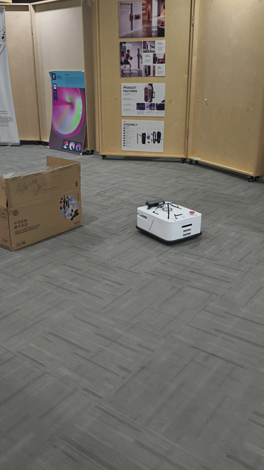

> **图 VI.I.1** 机器人在实验室走廊实景中移动。

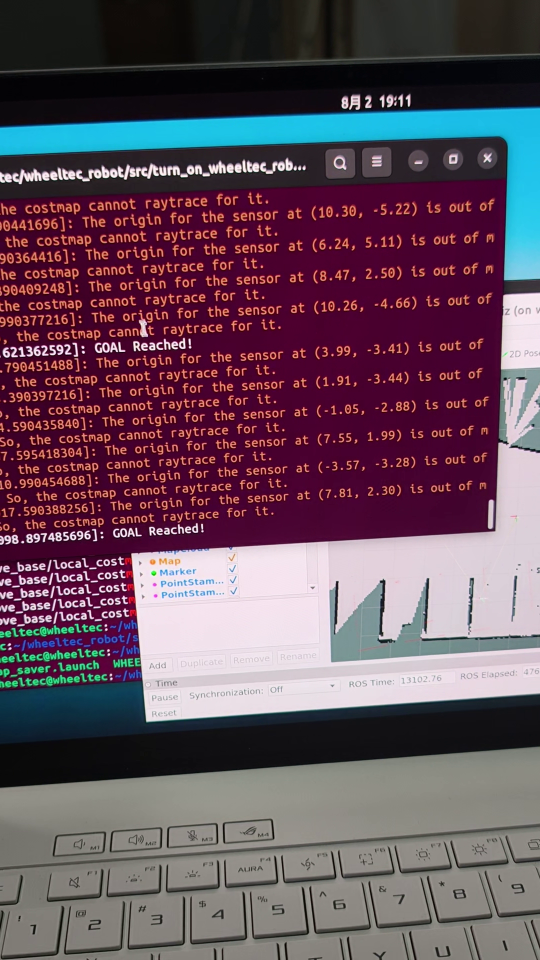

> **图 VI.I.2** 机器人到达目标。终端日志显示 `GOAL Reached!`，RViz 中可见 SLAM 建出的占据栅格地图。

**素材信息**

| 项 | 值 |
|---|---|
| 文件 | `src/deploy/wheeltec_s100/media/wheeltec_s100_nav2_baseline.mp4` |
| 拍摄时间 | 2026-08-02 19:10 |
| 规格 | 1920×1080，30 fps，35.9 s，1078 帧，66 MiB |
| md5 | `ea2b8d4cb833591767b85295148a8172` |
| 关键帧 | `src/deploy/wheeltec_s100/media/frames/nav2_demo_{scene,rviz}_{1-3}.png`（540×960，已校正方向） |

**这组素材说明什么、不说明什么**

| 说明 ✅ | 不说明 ❌ |
|---|---|
| S100 硬件平台可正常上电运行 | 本文的 **PPO 策略**已在真机上跑通 |
| 底盘驱动、里程计、传感器链路工作正常 | PPO 策略达到了 §VI.B 的三条「跑通」标准 |
| **传统 Nav2 栈**（AMCL + costmap + 规划器）在该平台上可用 | PPO 优于或劣于 Nav2 |
| 存在可供对比的基线系统 | — |

**为什么这组证据仍然有价值**：

1. **确立了对比基线**。§I.A 论述的"分层架构 vs 端到端"在本项目中第一次有了实机对照物 —— Nav2 栈能在该场地上把机器人从 A 点带到 B 点，而 PPO 策略的端到端替换尚未跑通。这为后续工作提供了明确的参照：**要证明端到端方案的价值，至少要在同一场地上达到 Nav2 基线的可靠性**。
2. **排除了硬件层面的疑因**。既然同一台机器人在同一场地上用 Nav2 可以正常导航，那么 PPO 路线遇到的困难就不能归因于底盘、传感器或驱动链路。
3. **记录了真机测试场地**。画面中的实际环境与 HM3D、Gibson 都存在明显差异，是 §VII.B 域差异分析的具体实例。

> **与 PPO 部署的关系**：本次录制的是 Nav2 基线，**不是** PPO 策略的运行画面。PPO 路线的真机状态见 §VI.G（单机推理验证通过）与 §VI.H（仿真测试未通过），满足三条「跑通」标准的完整真机运行尚未实现（见 §VIII.D）。

---

## VII. 失败分析


### A. TorchScript 导出缺陷 —— 唯一完全可复现的原创发现

#### A.1 问题发现

在核查 **TB3 / Orange Pi 部署线**（Week 6）所用的导出产物时，对**导出的 TorchScript 模型**与**训练后的 checkpoint** 做了逐张量比对。结果发现：导出件并非训练模型的忠实副本。

> **与 §VI 的区别**：本缺陷发生在 `src/deploy/turtlebot3/` 这条线上，导出源是本人训练的 Gibson `ckpt.99.pth`。§VI 描述的 S100 部署线使用的是合作者的 HM3D `ckpt.49.pth`，**直接加载 checkpoint，未经 TorchScript 导出**。两条线的产物不可互相印证。

#### A.2 证据

| 张量 / 结构 | 训练后 `ckpt.99.pth` | 导出件 `policy_depth_jit.pt` | 结论 |
|---|---|---|---|
| `conv1.weight` | shape (32,1,7,7)<br>min −0.8373, max 0.5197<br>**std 0.1958** | shape (32,1,7,7)<br>min −0.1426, max 0.1426<br>**std 0.0829** | **默认随机初始化** |
| `conv1` 后的归一化层 | **GroupNorm**（仅 γ/β，设计上无 running 统计量） | **BatchNorm2d**（γ/β/mean/var 全为默认值） | **归一化类型被替换** |
| `layer1.0.downsample` | **不存在**（stride=1 且通道不变，无需下采样分支） | Conv(32,32,1,1) + BN，**逐张量均为默认初始化** | **多出一个未训练分支** |
| GRU 层数 | **1 层**（仅 `weight_ih_l0`） | **3 层**（`_l0`, `_l1`, `_l2`） | `_l1`/`_l2` **无训练对应物** |
| `visual_fc` / `action_head` / `tgt_emb` / `gru._l0` | — | 逐位相同（`torch.equal == True`） | ✅ 正确载入 |
| `critic.fc`（价值头） | 存在（513 个参数） | **不存在** | Actor-only 导出，价值头被丢弃 |
| **参数总量**（仅计参数，不含缓冲） | **5,817,093** | **8,969,540** | 净差 **+3,152,447** |

**判据**：导出件中 `conv1.weight` 的取值范围是 **±0.1426**，而 `1/√(1×7×7) = 1/7 = 0.14286` 正是 PyTorch `kaiming_uniform(a=√5)` 对 `fan_in = 1×7×7 = 49` 的默认初始化上界 —— **该张量从未被写入过训练权重**。归一化层同理：γ/β/mean/var 分别为 1.0/0.0/0.0/1.0，是 BN 的出厂值。

进一步地，对整个导出文件做了全量搜索：遍历所有张量，查找形状为 (32,1,7,7) 且标准差约 0.1958 者，结果是—— **训练后的 `conv1` 在导出文件中根本不存在**。导出件中共有 **14 个张量**在训练 checkpoint 中找不到对应物。

**参数量核算**：

```
+3,151,872   2 层额外 GRU（_l1 / _l2）的全部权重与偏置
+    1,088   多出的 layer1.0.downsample 分支（1,024 + 32 + 32）
-      513   被丢弃的价值头 critic.fc（weight 512 + bias 1）
──────────
+3,152,447   净差
```

**根因**：`src/deploy/turtlebot3/jit_policy.py` 的**架构定义**与训练侧不一致 —— 其 `_make_layer()` 无条件构建下采样分支，`nn.GRU(576, 512, 3)` 把层数硬编码为 3，归一化层用 `nn.BatchNorm2d` 而训练侧是 `nn.GroupNorm`。对照之下，同目录的 `pointnav_inference.py` 用 `if stride != 1 or in_c != out_c` 做了守卫，其导出产物 `model_depth_only.pt` 是忠实的（conv1 std 0.1958）。

#### A.3 因果链

```
导出脚本的架构定义与训练侧不一致（jit_policy.py）
        ↓
conv1 与归一化层未匹配上 → 保持默认初始化（且归一化类型被换成 BatchNorm）
layer1.0 多建一个下采样分支 → 默认初始化
GRU 按硬编码的 3 层构造 → 仅 _l0 收到训练权重
全连接层 / 动作头映射正确 → 被正确载入
        ↓
导出件 = 全连接部分正确 + 视觉主干特征提取严重损坏 + 2/3 循环层随机
        ↓
预期表现：策略仍会输出动作（动作头正确），
          但视觉特征提取已失去大部分信息，难以形成稳定的目标导向行为
```

#### A.4 影响

| 影响面 | 说明 |
|---|---|
| **受评模型与部署产物脱钩** | 97.8% / 89.9% 描述的是 **`ckpt.99.pth`**；TB3 线上实际运行的是本节的导出件，二者在视觉主干上差异很大 |
| **TB3 线结论的有效性** | Week 6 基于该导出件得出的"模型响应环境但不收敛"的定性结论，反映的是**有缺陷的产物**，不能作为对该策略本身的评价 |
| **无声性** | 该缺陷不会报错、不会崩溃、不产生 NaN，`load_state_dict(strict=False)` 只打印一行 `Missing keys` 警告即被忽略 |

#### A.5 可复现的验证方法

```bash
cd FURP-2026-YicongNing-RLNavigationForAMR
conda run -n habitat python3 -c "
import torch
sd = torch.jit.load('src/deploy/turtlebot3/policy_depth_jit.pt').state_dict()
ck = torch.load('../habitat-lab/data/checkpoints/depth_only_pointnav_gibson/ckpt.99.pth',
                map_location='cpu', weights_only=False)['state_dict']
print('conv1 std  JIT =', sd['conv1.weight'].float().std().item())
print('conv1 std  ckpt=', ck['net.visual_encoder.backbone.conv1.0.weight'].std().item())
print('GRU layers JIT =', len([k for k in sd if k.startswith('gru.weight_ih')]))
print('GRU layers ckpt=', len([k for k in ck if k.startswith('net.state_encoder.rnn.weight_ih')]))
"
```

**预期输出**：`0.0829` / `0.1958` / `3` / `1`。

#### A.6 教训

`load_state_dict(..., strict=False)` 与 `torch.jit.script` 的组合会在**静默状态**下产出错误产物。**部署前必须做权重一致性校验**，至少包括：① 参数量比对；② 关键张量的统计量比对（而非仅形状）；③ 用同一批固定观测分别跑原始模型与导出模型，比对输出 logits 是否一致。本项目在部署前**缺失了这一校验环节**。

### B. 仿真到真机的域差异

即使修复导出缺陷，策略仍面临系统性的域差异。以下逐项列出并量化：

| 差异项 | 训练侧（Habitat / Gibson·HM3D） | 真机侧 | 影响 |
|---|---|---|---|
| **视场角 HFOV** | 90° | 约 **57.6°** | 视野收窄 36%，边缘障碍物进入视野更晚，避障余量减少 |
| **RGB 来源** | 渲染的真实彩色图像 | **红外灰度**（Astra S 无物理彩色传感器） | 颜色通道信息实际不可用；预处理需按 `mono8` 复制三通道 |
| **深度生成原理** | 光栅化渲染，理论精确 | 结构光，反射/暗色/远距离表面产生**零值空洞** | 需中值填补；远处与玻璃/金属表面不可靠 |
| **相机安装高度** | 1.25 m | 约 0.22 m（TB3 平台） | 视角完全改变，地板占据画面更大比例；需底部裁剪 |
| **传感器帧率** | 渲染帧率 | 深度流实测 **29.7–29.9 Hz** | 与 10 Hz 控制频率匹配良好，非瓶颈 |

真机侧的具体缓解手段（`src/deploy/s100_deploy/scripts/preprocess.py` 与 TB3 侧的 `d455_preprocess.py`）：

- **底部裁剪**：丢弃画面底部约 180 行（地板区域），减少近距离地板对深度安全刹停的误触发。该手段**仅存在于 TB3 侧** `d455_preprocess.py`（`CROP_BOTTOM_PX = 180`）；S100 侧 `preprocess.py` 没有裁剪，因两者相机安装高度不同；
- **最小深度限制**：TB3 侧设 `MIN_DEPTH=0.5 m` 以过滤地板反射与车身自身；而 S100 侧 `preprocess.py` 明确设 `MIN_DEPTH=0.0`，**以对齐训练配置**；两者取值不同，源于相机安装高度差异；
- **深度安全刹停阈值**：悬空调试用 0.05 m，落地运行用 0.2 m（`commands_reference.md`）。

**纹理梯度诊断**：`commands_reference.md` 提供了一条经验判据 —— 若 RGB 纹理梯度 **< 25**（该文档标注 `>25=OK`），说明场景纹理过弱，模型难以判断方向，应改用纯深度模型或为环境增加视觉特征。

### C. 动作震荡（head-shaking）

**现象**：机器人在 TURN_LEFT 与 TURN_RIGHT 之间反复切换，不产生前向位移。

这是 PointNav 策略的经典问题：当目标角度落在决策边界附近时，两个转向动作的 logits 接近，argmax 在相邻控制步之间翻转，形成抖动。项目文档（`src/deploy/s100_deploy/README.md`、`docs/06_weekly.md`）将其列为已知问题，并建议用 `step` 模式缓解。

**本章补充的判断**：TB3 线上至少有**两个独立的候选原因**，二者都足以单独造成震荡，且都未被排除。

**候选原因一 —— §VII.A 的导出缺陷。** 视觉主干的特征提取被破坏后，策略只能依赖目标向量与循环状态的微弱信号做决策，决策边界附近的翻转会显著加剧。

**候选原因二 —— 目标向量编码不匹配。** 训练好的 `tgt_embeding` 是 `Linear(3→32)`，其三个输入通道为 habitat 的 `[ρ, cos(−φ), sin(−φ)]`（见 `resnet_policy.py`：2 维 POLAR 输入会被扩成这 3 维）。而 TB3 侧 `d455_deploy.py` 传入的是 `(ρ, −φ, yaw)` —— **形状对得上、语义不对**：第 2、3 通道既不是余弦也不是正弦。目标角度编码错误会直接让转向方向失去依据，同样产生来回翻转。

**对照**：S100 侧 `s100_inference_node.py` 传入 2 维 `(距离, 角度)`，由策略内部完成扩维，**这条路径是正确的**。也就是说该缺陷只存在于 TB3 线。

**因此**：仅凭现有证据**不能**把 TB3 的震荡单独归因于导出缺陷，也不能归因于策略本身。两者的相对贡献需要分别隔离验证。

**建议的排查顺序**：
1. 做 §VII.A.5 的一致性校验，确认导出产物与受评模型一致；
2. 修正 TB3 的目标向量编码，使其与 habitat 的 `[ρ, cos(−φ), sin(−φ)]` 一致；
3. 完成上述两项后再评估震荡是否仍存在；
4. 若仍存在，再考虑动作平滑（连续 N 次同向才执行）或迟滞（hysteresis）等后处理手段。

### D. HM3D 模型的失败分类

> **数据来源：合作者仓库。** 下表 **baseline 三行**由本人从 `results/failure_analysis/baseline_seed{100,200,300}.json`（各 200 episode）用脚本独立重算，结果与上游一致；**stop_aware 各行**在仓库中没有逐 episode 记录，仅有合作者的文本汇总 `stop_aware_summary.json`，故这几行属**照引**而非重算。失败分类的阈值定义沿用其方法学：`lost > 1.0 m`、`bad_stop 0.35–1.0 m`、`near_miss 0.2–0.35 m`、`success ≤ 0.2 m`。

| 实验 | 种子 | 成功率 | SPL | 平均 DTG | 失败数 | lost | near_miss | bad_stop |
|---|:---:|:---:|:---:|:---:|:---:|:---:|:---:|:---:|
| baseline | 100 | 0.755 | 0.617 | 1.315 | 49 | 32 | 15 | 2 |
| baseline | 200 | 0.885 | 0.712 | 0.602 | 23 | 13 | 9 | 1 |
| baseline | 300 | 0.895 | 0.732 | 0.611 | 21 | 13 | 6 | 2 |
| **baseline 合并** | — | **0.845** | **0.687** | 0.843 | **93** | **58 (62%)** | **30 (32%)** | **5 (5%)** |
| stop_aware | 100 | 0.895 | 0.730 | 0.727 | — | 13 | 8 | 0 |
| stop_aware | 200 | 0.875 | 0.719 | 0.770 | — | 14 | 10 | 1 |
| stop_aware | 300 | 0.900 | 0.745 | 0.842 | — | 15 | 5 | 0 |
| **stop_aware 合并** | — | **0.890** | **0.731** | 0.780 | **66** | **42** | **23** | **1** |
| stop_aware_5e7 | 300 | **0.945** | **0.820** | **0.515** | 11 | 8 | 3 | 0 |

**关键观察**：

1. **`lost`（完全迷路 / 超时未达）是首要失败模式，占基线失败的 62%**。这不是差一点的问题，而是策略彻底失去目标导向 —— 与 §VII.C 的震荡问题在表现形式上一致。
2. **`bad_stop` 占比很低（5%）**，说明「到了却不停」不是主要矛盾；反而 `near_miss`（距离 0.2–0.35 m，差一点点）占 32%，属于停止精度问题。
3. **跨 seed 方差很大**：基线三个种子的成功率从 0.755 到 0.895，跨度 14 个百分点，跨 seed 标准差 0.063 —— 说明导航策略的训练结果对随机种子敏感，单次训练的结果只反映该种子下的表现。
4. **stop_aware 变体把跨 seed 标准差从 0.063 降到 0.011（降低约 82%）**，说明一次性终端奖励主要改善的是**训练稳定性**而非单纯抬高均值。

**验证场景覆盖**：三个 JSON 分别覆盖 **11 / 12 / 12** 个不同的验证场景，每个场景 1–25 个 episode（分布很不均：seed100 有场景仅 1 个 episode，seed200/300 最少 2 个，最多均为 25 个）。该覆盖范围是解读上述成功率时需要考虑的因素。

#### D.1 三种失败/成功形态的对照

> 以下关键帧取自合作者仓库的 3 段演示录像（`src/joint_phase/videos/`）。**数据来源：合作者仓库**。

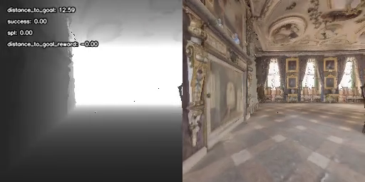

> **图 VII.D.1 —— `lost`（完全迷路）**。终点距目标 **12.77 m**，策略彻底失去目标导向。该类占基线失败的 **62%**，是首要失败模式。

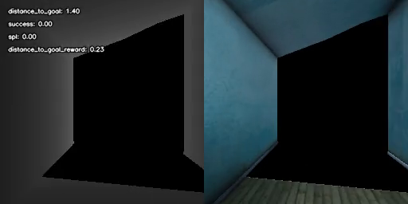

> **图 VII.D.2 —— `near_miss`（差一点点）**。终点距目标 **0.21 m**，而成功阈值为 0.20 m —— **仅差 1 厘米**。该类占失败的 32%，属停止精度问题而非导航能力问题。

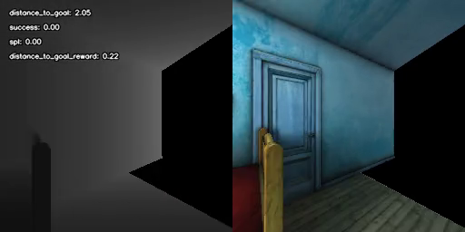

> **图 VII.D.3 —— `success`**。终点距目标 **0.01 m**，近乎完美。

三张图并列可见：**失败并非「走得到」与「走不到」的二元对立**，而是一个连续谱 —— 从完全迷路（12.77 m）到差 1 厘米（0.21 m）到精准抵达（0.01 m）。这解释了为什么单纯提高成功率需要同时解决两类性质完全不同的问题：**导航能力**（lost）与**停止判定**（near_miss / bad_stop）。

### E. 失败模式汇总与错误分类

| 失败类别 | 表现 | 归因层次 | 本项目证据 |
|---|---|---|---|
| **产物缺陷** | 部署件与受评模型不一致，动作随机化 | 工程链路 | §VII.A（张量级，**完全可复现**） |
| **域差异** | 观测分布偏移，策略失效 | 数据/传感器 | §VII.B（FOV、灰度、空洞、高度） |
| **迷路 lost** | 长时间偏离目标或超时 | 策略/探索 | §VII.D（占失败 62%） |
| **停止误差 near_miss** | 到达 0.2–0.35 m 但未进入阈值 | 奖励设计 | §VII.D（占失败 32%） |
| **提前停止 bad_stop** | 在 0.35–1.0 m 处停止 | 奖励设计 | §VII.D（占失败 5%） |
| **动作震荡** | TURN_LEFT↔RIGHT 抖动 | 决策边界 + 两个未排除的候选原因 | §VII.C |
| **运维缺陷** | watchdog 在训练结束后仍持续重启任务约 31 小时 | 工程运维 | §V.D |
| **场景泛化不足** | 仿真有效、Gazebo 失效 | 域差异 | §VI.H（持续输出单一动作） |

---

## VIII. 讨论

### A. 关于评估方式的选择

本项目的 Gazebo 测试（§VI.H）提供一个有价值的负面结论：**端到端视觉导航策略不能在与训练分布差异过大的仿真器中评估**。Gazebo 的几何化场景缺乏真实纹理，而该策略的视觉编码器是在真实室内扫描数据上训练的，二者之间的域差距足以让策略完全失效。

这不意味着 Gazebo 测试没有价值 —— 它验证了**工程链路**（传感器接入、推理、控制输出、进程间通信）的正确性，这正是它的定位。但**策略性能的评估必须在训练同分布的环境（Habitat）中进行**，或直接在真机上做。

这一点与已有研究 **[7]** 的结论一致。

### B. 关于模态选择的结论边界

§V 显示 Depth-only 不劣于 RGBD，且训练与部署成本更低。这一结论有其适用边界：

1. **数据集**：仅在 Gibson 上验证，Gibson 场景的纹理与几何分布不一定代表真实环境；
2. **环境**：结论来自仿真；真机的 RGB 通道实际是红外灰度（§VII.B），这一差异尚未在仿真中建模；
3. **训练规模**：RGBD 训练至 32.4 M 步（计划的 43%），Depth-only 训练至 75 M 步（100%），两者的训练预算不同。

因此，工程上的合理选择是**优先部署深度单模态模型**（更轻、更快、传感器需求更低），而深度模态在更广泛意义上是否严格更优，需要更多数据集与训练预算下的对照实验来回答。

### C. 工程产出的可复用性

本项目形成的以下资产对后续模型有直接复用价值：

| 资产 | 位置 | 复用价值 |
|---|---|---|
| `habitat_stub` 依赖注入方案 | `src/deploy/s100_deploy/scripts/habitat_stub.py` | 任何不装 habitat_sim 但要用 habitat-baselines 的部署场景 |
| 离散动作 → cmd_vel 转换层 | 同目录 `action_controller.py` | 任何离散动作空间的导航策略 |
| TCP bridge 仿真测试平台 | 同目录 `gazebo_sim/` | 任何 ROS 2 与另一个 Python 环境的集成场景 |
| 权重一致性校验方法 | §VII.A.5 | **任何 TorchScript 部署前都应执行** |
| 部署阶段规格文档 | `src/deploy/wheeltec_s100/01-goal.md` 等 | 定义了后续模型需满足的观测/动作接口 |

### D. 本工作的主要不足

1. **单随机种子**：两个模型的训练结果均来自 seed 42 的一次训练，未做多种子重复，因此无法给出跨 seed 的稳定性证据。
2. **评估证据样本量有限**：保留的回合录像仅个位数段，不足以支撑统计性结论；训练与评估过程的结果留存也不够完整，给复验带来困难。
3. **导出链路缺陷尚未修复**：§VII.A 定位了问题，但本报告范围内**未重跑导出脚本**验证修复效果，因此无法确认修复后的真机表现。
4. **真机全链路尚未闭环**：`src/deploy/wheeltec_s100/03-roadmap.md` 中 M2–M6 的里程碑尚未完成，满足「到达目标 + 零碰撞 + 无人工干预」三条标准的完整真机运行尚未实现。
5. **仿真域差异尚未建模**：真机的深度空洞与红外灰度 RGB 未在仿真中体现，域随机化手段尚未引入。
6. **模态对照的适用范围有限**：双模态结论基于单一数据集（Gibson）与单次训练预算，其普适性有待在更多数据集与预算下检验。

---

## IX. 结论与未来工作

### A. 结论

1. 在 Habitat 平台上成功复现了 DD-PPO 的 PointGoal 导航方法，训练出两个稳定收敛的模型：**RGBD（5,821,797 参数）** 与 **Depth-only（5,817,093 参数）**，成功率分别达到 96.9% 与 97.8%（近 10 记录点均值）。
2. 在**同数据集、同超参、同种子**的受控条件下完成双模态对比，发现深度单模态在本任务上不劣于 RGBD，且训练吞吐高约 2.4 倍、部署传感器需求更低。
3. 完成了 PointGoal PPO 策略向 WHEELTEC S100 真机平台的部署链路设计，涵盖离散动作转换、Habitat 依赖注入、ROS 节点封装与单机验证。
4. **定位并完整刻画了一处 TorchScript 导出缺陷** —— 部署件的 `conv1` 与归一化层停留在默认初始化（归一化类型亦被替换），多出一个未训练的下采样分支，GRU 被错误构造为 3 层。该缺陷静默不发生报错，却使对外报告的指标与实际运行的模型脱钩。这是本报告证据最充分的原创发现。
5. 系统梳理了仿真到真机的域差异，并指出评估端到端视觉导航策略**必须**在训练同分布环境中进行。

### B. 未来工作

**优先级 1 —— 修复并验证导出链路**
重写 TorchScript 导出脚本，加入强制键名断言（`strict=True`），并实现 §VII.A.5 的三方一致性校验（参数量 / 张量统计量 / 固定输入下的输出比对），纳入部署前检查清单。

**优先级 2 —— 补齐评估证据**
- 多种子重复训练（至少 3 个种子），给出跨 seed 的均值与标准差；
- 扩大评估回合样本（每模型 ≥20 回合），建立 ≥3 成功 + ≥3 失败的完整案例集；
- 完善结果留存流程：训练指标、评估结果、推理延迟一律写入文件。

**优先级 3 —— 域差异的针对性处理**
- 在仿真中建模真机的深度空洞与灰度 RGB；
- 引入域随机化（相机高度、视场角、深度噪声、光照）提升泛化；
- 调研针对结构化光深度相机的空洞填补与不确定性建模。

**优先级 4 —— 真机全链路闭环**
完成 `src/deploy/wheeltec_s100/03-roadmap.md` 中 M2–M6 的剩余里程碑，在受控场地完成至少一次满足「到达目标 + 零碰撞 + 无人工干预」三条标准的完整运行，并留存完整证据。

---

## 参考文献

[1] E. Wijmans, A. Kadian, A. Morcos, S. Lee, I. Essa, D. Parikh, M. Savva, D. Batra. *DD-PPO: Learning Near-Perfect PointGoal Navigators from 2.5 Billion Frames.* ICLR 2020. arXiv:1911.00357.

[2] M. Savva, A. Kadian, O. Maksymets, Y. Zhao, E. Wijmans, B. Jain, J. Straub, J. Liu, V. Koltun, J. Malik, D. Parikh, D. Batra. *Habitat: A Platform for Embodied AI Research.* ICCV 2019. arXiv:1904.01201.

[3] F. Xia, A. R. Zamir, Z. He, A. Sax, J. Malik, S. Savarese. *Gibson Env: Real-World Perception for Embodied Agents.* CVPR 2018.

[4] S. K. Ramakrishnan, A. Gokaslan, E. Wijmans, O. Maksymets, A. Clegg, J. Turner, E. Undersander, W. Galuba, A. Westbury, A. X. Chang, M. Savva, Y. Zhao, D. Batra. *Habitat-Matterport 3D Dataset (HM3D): 1000 Large-scale 3D Environments for Embodied AI.* NeurIPS 2021 (Datasets and Benchmarks Track). arXiv:2109.08238.

[5] J. Schulman, F. Wolski, P. Dhariwal, A. Radford, O. Klimov. *Proximal Policy Optimization Algorithms.* arXiv:1707.06347, 2017.

[6] P. Anderson, A. Chang, D. S. Chaplot, A. Dosovitskiy, S. Gupta, V. Koltun, J. Kosecka, J. Malik, R. Mottaghi, M. Savva, A. R. Zamir. *On Evaluation of Embodied Navigation Agents.* arXiv:1807.06757, 2018.

[7] A. Kadian, J. Truong, A. Gokaslan, A. Clegg, E. Wijmans, S. Lee, M. Savva, S. Chernova, D. Batra. *Sim2Real Predictivity: Does Evaluation in Simulation Predict Real-World Performance?* IEEE Robotics and Automation Letters, 2020. arXiv:1912.06321.

[8] Z. Chen. *furp-2026-Zhihao-Chen-End-to-End-RL-Navigation*（合作阶段仓库）. https://github.com/ssyzc19/furp-2026-Zhihao-Chen-End-to-End-RL-Navigation

---

## 附录 A —— 证据清单

> **分级约定**：附录表格中的「实测有产物」表示本次工作中通过命令/脚本直接验证、且产物留存于本仓库；「文档记录」表示来自本仓库或部署文档的书面记载。

### A.1 模型与训练

| 结论 | 数值 | 等级 | 出处 |
|---|---|:---:|---|
| RGBD 参数量 | 5,821,797 | 实测有产物 | `ckpt.43.pth` state_dict |
| Depth-only 参数量 | 5,817,093 | 实测有产物 | `ckpt.99.pth` state_dict |
| 输入通道数 | 4 / 1 | 实测有产物 | `conv1` 张量形状 |
| GRU 层数 | 1 | 实测有产物 | checkpoint 张量键 |
| RGBD 四指标曲线 | SR 0.9606 / SPL 0.8477 / reward 6.4798 / DTG 0.1843 | 实测有产物 | `src/lab2/results/*.png` |
| Depth-only 首末指标 | SR 0.078→0.979 / SPL 0.059→0.901 | 实测有产物 | `train_depth_only.log` 首末行 |
| Depth-only 吞吐 | 362→376 fps | 实测有产物 | 同上 |
| 重启循环 | 训练结束后 watchdog 仍重启 706 次 | 实测有产物 | `train_depth_only.log` |
| RGBD 训练吞吐 | ~160 fps | 文档记录 | `docs/04_weekly.md` |

### A.2 评估

| 结论 | 数值 | 等级 | 出处 |
|---|---|:---:|---|
| RGBD 评估录像 | 3/3 成功，平均 SPL 0.950 | 实测有产物 | `src/lab2/results/*.mp4` 文件名 |
| Depth-only 评估录像 | 5/5 成功，平均 SPL 0.832 | 实测有产物 | `habitat-lab/data/video/depth_only_final/` |
| 近 10 记录点均值 | RGBD 96.9%±0.5 / Depth 97.8%±0.3 | 实测有产物 | `src/lab2/README.md` 与 `src/lab3/README.md` |

### A.3 部署

| 结论 | 数值 | 等级 | 出处 |
|---|---|:---:|---|
| Jetson 推理延迟 | 16.1 ms（min 14.2 / max 21.9）≈62 Hz | **文档记录** | `src/deploy/wheeltec_s100/03-roadmap.md` |
| M1 加载成功 / 5 步稳定 | — | **文档记录** | 同上 |
| S100 深度流帧率 | 29.7–29.9 Hz | 实测有产物 | `src/deploy/wheeltec_s100/info.md` |
| S100 平台环境（aarch64/Noetic/Py3.8） | — | 实测有产物 | 同上 |
| S100 `/cmd_vel` 消费者 | `wheeltec_robot` 节点 | 文档记录 | `src/deploy/wheeltec_s100/02-tech-stack.md` |
| M2–M6 里程碑 | 全部未勾选 | 文档记录 | `src/deploy/wheeltec_s100/03-roadmap.md` |
| Gazebo 测试失败现象 | 持续输出 TURN_RIGHT 至超时 | 实测有产物（本次运行） | `src/deploy/wheeltec_s100/media/gazebo_ppo_test.mp4` |

### A.4 核心原创发现

| 结论 | 数值 | 等级 | 出处 |
|---|---|:---:|---|
| 导出件 `conv1` 为默认初始化 | std 0.0829（= 均匀分布 ±1/7） | 实测有产物 | §VII.A.5 脚本可复现 |
| 训练 `conv1` 在导出件中不存在 | 全量搜索未命中 | 实测有产物 | 同上 |
| 导出件 GRU 层数 | 3（训练为 1） | 实测有产物 | 同上 |
| 参数量膨胀 | 5,817,093 → 8,969,540（+3,152,447） | 实测有产物 | 同上 |

### A.5 合作材料（引用，非本人成果）

| 数据 | 说明 | 等级 | 出处 |
|---|---|:---:|---|
| 三 seed 逐回合记录 | 各 200 episode | 实测有产物（已独立重算） | `src/joint_phase/results/failure_analysis/*.json` |
| 失败分解 | baseline 合并 93 失败 = lost 58 / near_miss 30 / bad_stop 5 | 实测有产物（已独立重算） | 同上 |
| 跨 seed 指标表 | `eval_summary.csv` | 实测有产物 | `src/joint_phase/results/` |
| 训练曲线 / 轨迹图 | 16 张 PNG | 实测有产物 | `src/joint_phase/figures/` |
| 演示片段 | 3 段 mp4 | 实测有产物 | `src/joint_phase/videos/` |
| **真机 `Goal reached`** | 纯文本断言 | **文档记录** | `stop_aware_summary.json` |

### A.6 视频关键帧

评估录像本身体量较大，本仓库**不全部纳入**。附录中只保留**最新 checkpoint** 的代表性录像关键帧，用 OpenCV 按 20% / 50% / 80% 三个时间点抽取，位于 `src/joint_phase/frames/`：

| 录像 | checkpoint | 选取理由 |
|---|:---:|---|
| `episode=705_1-ckpt=43` | RGBD **ckpt.43**（最新） | 终点距目标 0.05 m，精度最佳 |
| `episode=652_1-ckpt=43` | 同上 | SPL 0.98，路径效率最佳 |
| `episode=456_1-ckpt=43` | 同上 | SPL 0.95，均衡案例 |
| `episode=132_1-ckpt=99` | Depth **ckpt.99**（最新） | SPL 1.00，严格最短路径 |
| `episode=76_1-ckpt=99` | 同上 | SPL 0.97，均衡案例 |
| `episode=423_1-ckpt=99` | 同上 | SPL 0.28 —— **唯一明显的低效案例**，值得单列 |
| `01_lost` / `02_nearmiss` / `03_success` | 合作者线 | 三种失败/成功形态的对照（见附录 B） |

共 9 段录像 × 3 帧 = **27 张关键帧**。原始录像仍保留在 `src/lab2/results/`、`src/lab3/results/` 与 `habitat-lab/data/video/depth_only_final/`，未做删除。

---

## 附录 B —— 合作阶段材料出处声明

真机部署阶段的模型来自**合作者 Zhihao Chen** 的 FURP 仓库。本报告对其材料的使用遵循以下边界：

**来源**

| 项 | 内容 |
|---|---|
| 仓库 | `https://github.com/ssyzc19/furp-2026-Zhihao-Chen-End-to-End-RL-Navigation` |
| 分支 | `master` |
| 作者 | Zhihao Chen |
| 许可证 | MIT License, © 2026 Zhihao Chen |
| 下载日期 | 2026-09-21 |
| 本地位置 | `src/joint_phase/` |

**使用边界**

1. **仅作对照与引用**。本报告 §V 的主体是本人训练的 Gibson 双模型；合作材料用于 §VII.D（HM3D 失败分类）与 §VII.D 的跨 seed 对照，**均在图注或正文标注来源**。
2. **真机结论的引用口径**：`stop_aware_summary.json` 中 `real_robot` 条目（`"Goal reached (2026-08-05)"` / `"Goal reached (2026-08-07)"`）在本报告中按**合作者的文档记录**引用。
3. **独立重算**：三个 `baseline_seed*.json` 的成功率、SPL、平均 DTG 与失败分解，均用脚本重新计算，结果与上游一致（见 §VII.D 与附录 A.5）。
